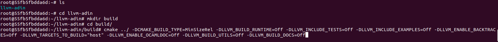
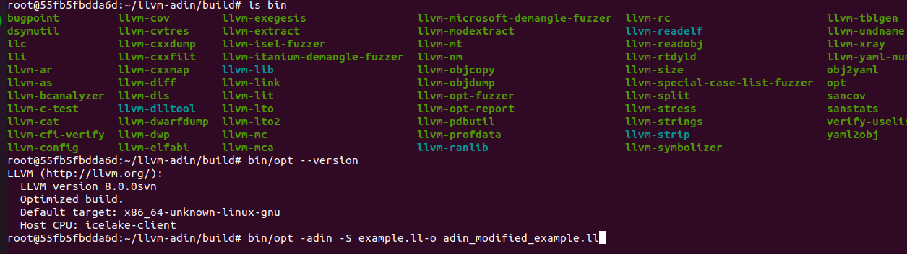
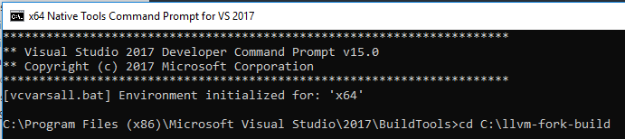
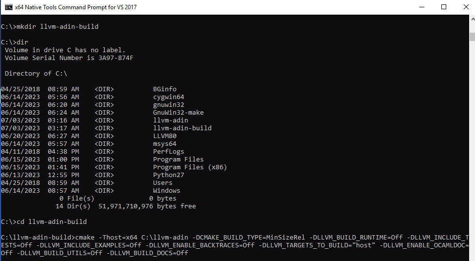

# ADIN LLVM Fork: Memory Operation Hooking

[](https://github.com/remotemcu/adin-llvm/actions/workflows/ubuntu.yml)
[](https://github.com/remotemcu/adin-llvm/actions/workflows/macos.yml)
[](https://github.com/remotemcu/adin-llvm/actions/workflows/windows-mingw.yml)


1. [Introduction](#introduction)
2. [Usage](#usage)
3. [How build](#how-build)
   * [Unix-like OS](#unix-like-os)
   * [Windows OS](#windows-os)

## Introduction:
The **ADIN LLVM Fork** is a specialized version of the LLVM compiler infrastructure that incorporates the [**ADIN code transformer pass**](https://github.com/remotemcu/adin-llvm-pass). This fork enables runtime interrupting technologies by allowing developers to hook memory operations, such as store and load operations, and replace them with custom hook functions. The **ADIN LLVM Fork** is particularly crucial for projects like [**REMCU Library**](https://github.com/remotemcu/remcu) and [**REMCU Chip SDKs**](https://github.com/remotemcu/remcu-chip-sdks), where it is used to hook peripheral register operations. 


## Usage:
To utilize the memory operation hooking capabilities of the **ADIN LLVM Fork**, you can modify LLVM IR compiled code using the `opt` tool with the `-adin` flag. Here's an example to help you understand the process:

Let's assume you have a simple C code file named `example.c`.
```c
int var = 0;

void f(){
	*(int*)0x100 = 1;
	var = *(int*)0x100;
}
```

 To compile it into LLVM IR code using Clang, execute the following command:

```shell
clang -S -emit-llvm example.c -o example.ll
```

This command will generate the LLVM IR code file `example.ll` based on your C code.
```llvm
; Function Attrs: noinline nounwind optnone uwtable
define dso_local void @f() #0 {
  store i32 1, i32* inttoptr (i64 256 to i32*), align 4
  %1 = load i32, i32* inttoptr (i64 256 to i32*), align 4
  store i32 %1, i32* @b, align 4
  ret void
}

```

Now, you can use the **ADIN LLVM Fork** to modify the LLVM IR code and add memory operation hooks. Run the following command:

```shell
opt -adin -S example.ll-o adin_modified_example.ll
```

the `-adin` flag indicates that you want to perform memory operation hooking on the input LLVM IR code. The modified LLVM IR code will be written to the `modified.ll` file.

```llvm
define dso_local void @f() #0 {
  call void @__adin_store_(i8* inttoptr (i64 256 to i8*), i64 1, i32 32, i32 4)
  %load_i32_ = call i64 @__adin_load_(i8* inttoptr (i64 256 to i8*), i32 32, i32 4)
  %truncated_i32_ = trunc i64 %load_i32_ to i32
  store i32 %truncated_i32_, i32* @b, align 4
  ret void
}

```

In the modified LLVM IR code (`modified.ll`), the original store and load operations have been replaced with the `__adin_store_` and `__adin_load_` functions. These functions are the hook functions provided by the ADIN LLVM Fork, which allow you to intercept and modify the behavior of memory operations.

You can define and implement these hook functions in C/C++ code to perform any desired modifications or additional actions before or after the memory operations.

 * `__adin_store_` function will be called instead of a regular store operation,
 * `__adin_load_` function will be called instead of a regular load operation.

To implement the **__adin_store_** and **__adin_load_** hook functions in your C/C++ code for performing desired modifications or additional actions before memory operations, you can follow a similar approach to what is done in the [Address Interceptor Lib]. Here's an example:

```c
extern "C" void __adin_store_(llvm_pass_addr pointer, llvm_value_type value, llvm_pass_arg TypeSizeArg, llvm_pass_arg AlignmentArg)
{
   //...
}

extern "C" llvm_value_type __adin_load_(const llvm_pass_addr pointer, llvm_pass_arg TypeSizeArg, llvm_pass_arg AlignmentArg)
{
   //...
}
```

Finally, you can use the LLVM IR code to continue with the compilation process, linking, and generating the final executable or library as needed.

Yes, the `opt` utility provided by the ADIN LLVM Fork also allows you to hook `memmove`, `memcpy`, and `memset` operations in addition to store and load operations. You can enable the hooking of these memory operations using specific options provided by `opt`. Here are the options you can use:

```
$ opt --help | grep adin
  -adin-alloca-address-skip                         - Skip intercept address on alloca frame (Stack var)
  -adin-check-normal-address-aligment               - Checks normal alignment of address attempt
  -adin-mem-function-instructions                   - if equal true - intercept memmove/memcpy/memset function, else skip
  -adin-name-callback-load=<string>                 - Set name callback of load operation. Default __adin_load_
  -adin-name-callback-memcpy=<string>               - Set name callback of memcpy operation. Default __adin_memcpy_
  -adin-name-callback-memmove=<string>              - Set name callback of memmove operation. Default __adin_memmove_
  -adin-name-callback-memset=<string>               - Set name callback of memset operation. Default __adin_memset_
  -adin-name-callback-store=<string>                - Set name callback of store operation. Default __adin_store_
  -adin-simple-global-skip                          - Skip intercept address of SIMPLE global var
  -adin-skip-unsupported-instructions               - if equal true - skip this unsupported instruction, else throw error
  -adin-verbose-level=<int>                         - Set Level of verbose for AddressIntercept Pass

```

## How build

### Unix-like OS

**Note:** This part of guide assumes that you have a basic understanding of software development, command-line tools, and are comfortable using a Unix-like operating system such as Linux or macOS. Some commands may need to be modified slightly if you are using a different operating system.

#### Prerequisites

Before proceeding with the build process, make sure you have the following prerequisites installed on your system:

1. **CMake**: LLVM uses CMake(version 3.5.1 or higher) as its build system. Ensure that you have CMake installed on your system. You can download CMake from the official website: https://cmake.org/download/

2. **GCC or Clang**: LLVM is primarily written in C++. You will need a C++ compiler to build LLVM. Ensure that you have either GCC or Clang installed on your system.

3. **Git**: You need Git version control system to clone the LLVM Adin Fork repository and manage source code. Install Git by following the instructions on the official website: https://git-scm.com/downloads

4. **Python**: LLVM build system relies on Python. Ensure that Python is installed on your system. You can download Python from the official website: https://www.python.org/downloads/

5. **Ninja (optional)**: Ninja is an alternative build system to Make. While not mandatory, it can speed up the build process. If you want to use Ninja, install it using your system's package manager.


I tested on ubuntu 16.04 OS

#### Building LLVM Adin Fork

Follow the steps below to build your LLVM Adin Fork:

##### Step 1: Clone the Repository

1. Open a terminal or command prompt.

2. Change to the directory where you want to clone the LLVM Adin Fork repository.

3. Clone the repository using the following command:
   ```
   git clone --recurse-submodules https://github.com/remotemcu/adin-llvm
   ```

##### Step 2: Configure the Build

1. Change to the LLVM Adin Fork directory:
   ```
   cd adin-llvm
   ```

2. Create a build directory:
   ```
   mkdir build
   cd build
   ```

3. Generate the build files using CMake:
   ```
   cmake .. -DCMAKE_BUILD_TYPE=MinSizeRel -DLLVM_BUILD_RUNTIME=Off -DLLVM_INCLUDE_TESTS=Off -DLLVM_INCLUDE_EXAMPLES=Off -DLLVM_ENABLE_BACKTRACES=Off -DLLVM_TARGETS_TO_BUILD="host" -DLLVM_ENABLE_OCAMLDOC=Off -DLLVM_BUILD_UTILS=Off -DLLVM_BUILD_DOCS=Off
   ```
   Replace `<generator>` with the appropriate generator for your system. For example, on Linux, you can use `"Unix Makefiles"` for Make or `"Ninja"` for Ninja.

   

   **Note:** If you are using Ninja:
   ```
   cmake -G Ninja .. -DCMAKE_BUILD_TYPE=MinSizeRel -DLLVM_BUILD_RUNTIME=Off -DLLVM_INCLUDE_TESTS=Off -DLLVM_INCLUDE_EXAMPLES=Off -DLLVM_ENABLE_BACKTRACES=Off -DLLVM_TARGETS_TO_BUILD="host" -DLLVM_ENABLE_OCAMLDOC=Off -DLLVM_BUILD_UTILS=Off -DLLVM_BUILD_DOCS=Off
   ```

##### Step 3: Build LLVM

1. Build LLVM using the generated build files:
   ```
   cmake --build . --config MinSizeRel
   ```
2. Grab a cup of coffee or tea as the build process might take some time depending on your system's speed and available resources.

3. Once the build is successfully completed, you can proceed to use the ADIN LLVM Adin Fork as desired. The built binaries can be found in the `build/bin` directory.



To locate the **opt** utility, which can be used for modifying LLVM intermediate representations, follow the steps below:

   * Open a file explorer or command prompt.

   * Navigate to the `build/bin` directory within your LLVM Adin Fork repository.

   * Look for the `opt` executable file. The exact file extension may vary depending on your operating system (e.g., .exe for Windows).


### Windows OS

Note that this guide assumes you are building on a Windows system and requires MSBuild from Visual Studio 2017.


#### Prerequisites

Before proceeding with the LLVM Adin Fork build, ensure that you have the following prerequisites installed on your Windows machine:

1. **MSBuild:** Install Microsoft Build Tools or Visual Studio 2017. You can download Visual Studio 2017 Community Edition from the official Microsoft website: [https://learn.microsoft.com/en-us/previous-versions/visualstudio/visual-studio-2017/install/use-command-line-parameters-to-install-visual-studio?view=vs-2017](https://learn.microsoft.com/en-us/previous-versions/visualstudio/visual-studio-2017/install/use-command-line-parameters-to-install-visual-studio?view=vs-2017) or https://aka.ms/vs/15/release/vs_BuildTools.exe. Make sure to select the required these components during the installation.


I build with next version:
```
  -- Selecting Windows SDK version 10.0.17763.0 to target Windows 10.0.17134.
  -- The C compiler identification is MSVC 19.16.27050.0
  -- The CXX compiler identification is MSVC 19.16.27050.0
```

2. **Python:** Install Python on your system. You can download the latest Python version from the official Python website: [https://www.python.org/downloads/windows/](https://www.python.org/downloads/windows/). Choose the appropriate version for your system (64-bit) and follow the installation instructions.

3. **Git:** Install Git version control system. You can download Git from the official Git website: [https://git-scm.com/downloads](https://git-scm.com/downloads). Choose the appropriate installer for your system and run the installation.

#### Building LLVM Adin Fork

Once you have installed the necessary prerequisites, follow the steps below to build the LLVM Adin Fork:

1. **Clone the LLVM Adin Fork Repository:** Open a command prompt or Git Bash and navigate to the directory where you want to clone the LLVM Adin Fork repository. Then, run the following command to clone the repository:

   ```shell
   git clone --recurse-submodules https://github.com/remotemcu/adin-llvm
   ```

2.  Open "x64 Native Tools Command Prompt for Visual Studio 2017" entry to open the command prompt.

	

3. In the command prompt window, navigate to the directory where you build the LLVM Adin Fork repository using the `cd` command. For example, if the cloned repository is located in `C:\llvm-adin` create `C:\llvm-adin-build` for building process

   

 	Make sure to replace `C:\llvm-adin` with the actual path to your LLVM Adin Fork repository.

4. **Configure the Build:** Run the following command from build dir (for example C:\llvm-fork-build) to generate the build files using CMake:

   ```shell
   cmake -Thost=x64 C:\llvm-adin -DCMAKE_BUILD_TYPE=MinSizeRel -DLLVM_BUILD_RUNTIME=Off -DLLVM_INCLUDE_TESTS=Off -DLLVM_INCLUDE_EXAMPLES=Off -DLLVM_ENABLE_BACKTRACES=Off -DLLVM_TARGETS_TO_BUILD="host" -DLLVM_ENABLE_OCAMLDOC=Off -DLLVM_BUILD_UTILS=Off -DLLVM_BUILD_DOCS=Off
   ```

   

   This command configures the build system for Visual Studio 2017. Adjust the generator (`-G`) argument if you are using a different version of Visual Studio.

5. **Build LLVM:** Once the configuration is complete, you can build LLVM by running the following command:

   ```shell
   cmake --build . --config MinSizeRel
   ```

 Once the build is successfully completed, you can proceed to use the ADIN LLVM Adin Fork as desired. The built binaries can be found in the `MinSizeRel\build\bin` directory.
To locate the **opt** utility, which can be used for modifying LLVM intermediate representations, follow the steps below:

   * Open a file explorer or command prompt.

   * Navigate to the `MinSizeRel\build\bin` directory within your LLVM Adin Fork repository.

   * Look for the `opt` executable file. The exact file extension may vary depending on your operating system (e.g., .exe for Windows).

   

---
LLVM is open source software. You may freely distribute it under the terms of
the license agreement found in LICENSE.txt.
